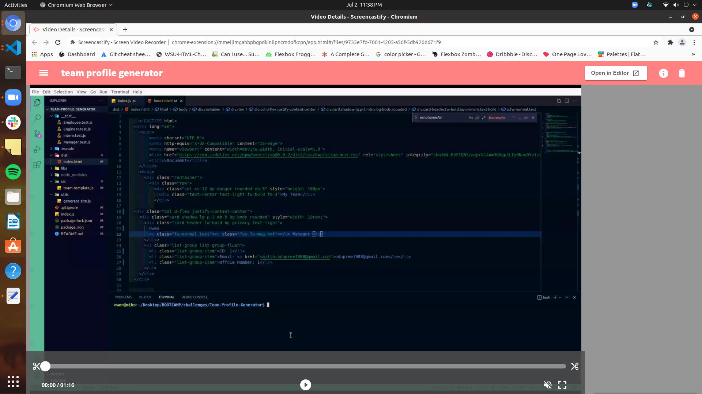

# Team-Profile-Generator

## Description

An application that allows the user to answer prompted questions with inquirer that then
generates an index.html page with employee information.

---

## Table of Contents

- [Installation](#installation)
- [Usage](#usage)
- [License](#license)
- [Test](#test)
- [Questions](#questions)

---

## Installation

After cloning the repository, run 'npm init', 'npm install inquirer' and 'npm install
jest--save-dev" in order to use the application.

---

## Usage

To start the application, type 'node index.js' in the terminal, then answer the
prompted questions. Once the prompt is terminated, open the 'dist'
folder to find the generated page. Click on the link below to view an instructional
video on how to use the application.

[Instructional Video](https://drive.google.com/file/d/1DTI3bDc6uePfmTgQrjVFI44SA1wQ1JYi/preview)

---

## License

MIT

Copyright (c) 2021 Owen Dupree

Permission is hereby granted, free of charge, to any person obtaining a copy
of this software and associated documentation files (the "Software"), to deal
in the Software without restriction, including without limitation the rights
to use, copy, modify, merge, publish, distribute, sublicense, and/or sell
copies of the Software, and to permit persons to whom the Software is
furnished to do so, subject to the following conditions:

The above copyright notice and this permission notice shall be included in all
copies or substantial portions of the Software.

---

## Test

- npm run test Employee
- npm run test Manager
- npm run Test Engineer
- npm run test Intern

---

## Questions

For any questions please contact me directly.

Email: <odupree1988@gmail.com>

GitHub: [odupree1988](https://github.com/odupree1988)

Made By Owen Dupree 2021

---
